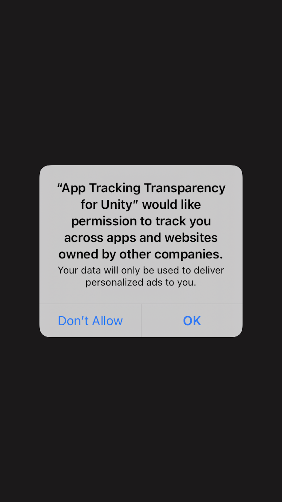

# App Tracking Transparency for Unity

## Requirements
[](https://unity3d.com/get-unity/download/archive)
[](https://docs.unity3d.com/2018.3/Documentation/Manual/ScriptingRuntimeUpgrade.html)

## Installation
### Unity Asset Store
Get it on [Unity Asset Store](https://assetstore.unity.com/packages/slug/174256)

## Introduction

This plugin allows your app/game to easily show the iOS 14 native App Tracking Transparency popup to your users, meeting Apple's requirement since iOS 14.

<p align="center">
	
</p>

## Usage

Register your callback to get notified with the authorization result and Rrequest tracking authorization

```csharp
AppTrackingTransparency.OnAuthorizationRequestDone += OnAuthorizationRequestDone;
AppTrackingTransparency.RequestTrackingAuthorization();
```

## Example

```csharp
using Balaso;
using UnityEngine;

/// <summary>
/// Example MonoBehaviour class requesting iOS Tracking Authorization
/// </summary>
public class AppTrackingTransparencyExample : MonoBehaviour
{
    void Start()
    {
#if UNITY_IOS
        AppTrackingTransparency.OnAuthorizationRequestDone += OnAuthorizationRequestDone;
        AppTrackingTransparency.RequestTrackingAuthorization();
#endif
    }

#if UNITY_IOS

    /// <summary>
    /// Callback invoked with the user's decision
    /// </summary>
    /// <param name="status"></param>
    private void OnAuthorizationRequestDone(AppTrackingTransparency.AuthorizationStatus status)
    {
        switch(status)
        {
            case AppTrackingTransparency.AuthorizationStatus.NOT_DETERMINED:
                Debug.Log("AuthorizationStatus: NOT_DETERMINED");
                break;
            case AppTrackingTransparency.AuthorizationStatus.RESTRICTED:
                Debug.Log("AuthorizationStatus: RESTRICTED");
                break;
            case AppTrackingTransparency.AuthorizationStatus.DENIED:
                Debug.Log("AuthorizationStatus: DENIED");
                break;
            case AppTrackingTransparency.AuthorizationStatus.AUTHORIZED:
                Debug.Log("AuthorizationStatus: AUTHORIZED");
                break;
        }

        // Obtain IDFA
        Debug.Log($"IDFA: {AppTrackingTransparency.IdentifierForAdvertising()}");
    }
#endif
}   

```
